# Ecommerce_Transaction_Analysis 🛒

*This project is a submission of the final requirement for the Data Science Bootcamp at Dibimbing.*

---

## **Business Background:**

Kestrel E-commerce, a rising star in the e-commerce industry, has experienced rapid growth since its inception in 2018, surpassing 30,000 customers and 50,000 transactions in its inaugural year. They face challenges in sales consistency, customer acquisition and retention, and customer understanding. To improve performance, the company aims to identify seasonal trends, optimize sales, enhance customer strategies, and personalize marketing.

## **Problem Definition:**

The business faces challenges in maintaining consistent sales and profits, acquiring and retaining customers, and understanding customer preferences to optimize strategies.

## **Objective:**

This project aims to leverage customer behavior data to answer key business questions and provide data-driven insights or actionable recommendations for optimizing marketing, enhancing customer retention, and elevating overall Kestrel E-commerce's performance in the coming year.

## **Methodology:**

* Use EDA to conduct a thorough exploration of the transaction data to uncover sales patterns and trends.
* Reveal customer cohorts to analyze customer behavior based on their acquisition cohorts to understand customer retention rates.
* Identify the most significant factors (customers and products) driving sales and profit, to prioritize efforts for maximum impact with pareto chart.
* Segment customers based on their Recency, Frequency, and Monetary value using a robust K Means clustering model for targeted customer engagement.

## **Data Source:**

The primary data source for this project is the first year (2018) of transaction history of Kestrel E-commerce in the United States, obtained from Kaggle [https://www.kaggle.com/datasets/carrie1/ecommerce-data/data](https://www.kaggle.com/datasets/carrie1/ecommerce-data/data). 

## **Data Undertstanding:**

The dataset describes the first year of transaction history of **Kestrel E-commerce** in the United States. Consist of 16 features and > 50.000 trx rows:

First Transactions 2018-01-01 | Last Transactions 2018-12-30
Day of Transactions 356 Days

* `Order_Date`: The date the product was ordered.
* `Aging`: The time from the day the product is ordered to the day it is delivered.
* `Customer_Id`: Unique ID created for each customer.
* `Gender`: Gender of the customer.
* `Device_Type`: The device the customer uses to actualize the transaction (Web/Mobile).
* `Customer_Login_Type`: The type the customer logged in. Such as Members, Guests, etc.
* `Product_Category`: The category of each product.
* `Product`: The description of products.
* `Sales`: Total sales amount (product price * quantity)
* `Quantity`: Unit amount of product.
* `Discount`: Percent discount rate.
* `Profit`: Profit.
* `Shipping_Cost`: Shipping cost.
* `Order_Priority`: Order priority. Such as critical, high, etc.
* `Payment_method`: Payment method.

## Exploratory Data Analysis

### Seasonality Analysis

#### Sales Performance
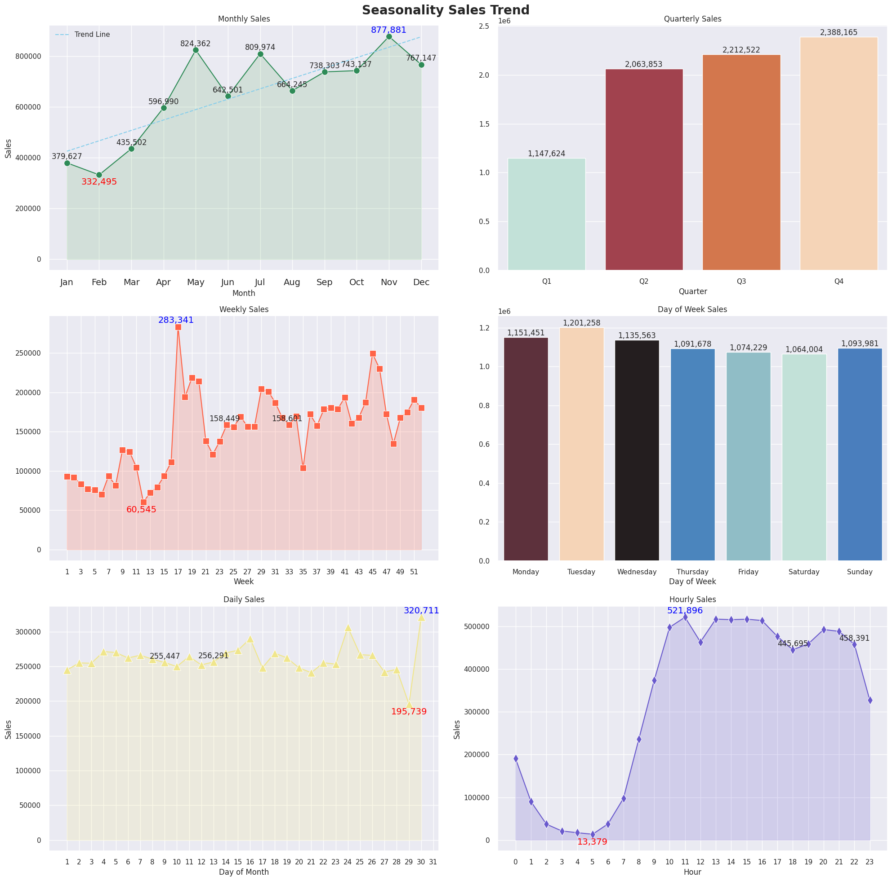

**Insight**:

Based on the seasonality sales trend, the sales are highest in November and May, with a dip in February. Across four quarters, sales are highest in Q4 and lowest in Q1. The sales appear to fluctuate with a peak around week 17. Sales peak around the 24th and 30th day of the month, but dip drastically on the 29th. Also, the highest sales were on Tuesday and Monday, with a dip on Saturday. The middle of the afternoon and late evening are the peak of sales, with a dip in the early morning.

#### Month-Over-Month Change

##### Sales Rate Change
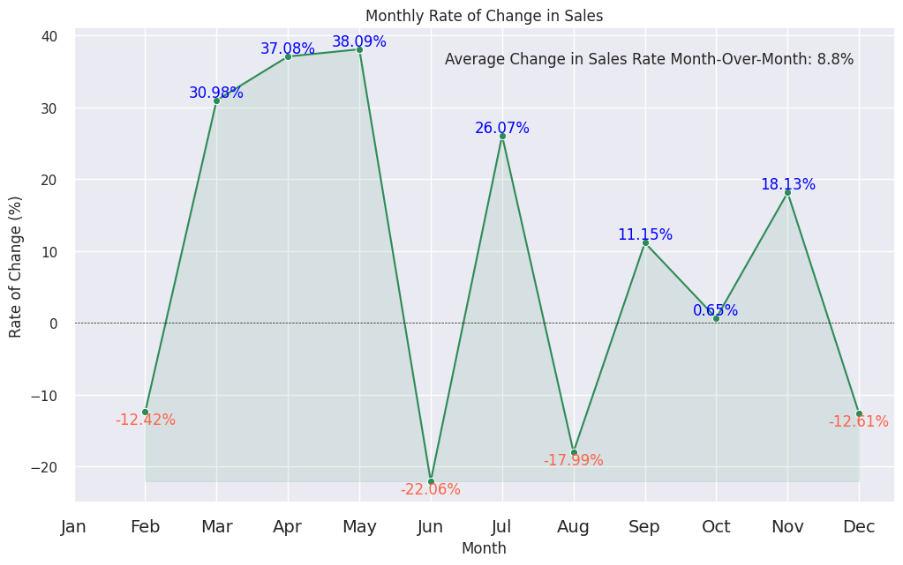

**Insight**:

Strong Growth Periods:
* March: Sales experienced a significant increase of 30.98% compared to the previous month.
* April: The momentum continued with an even higher growth rate of 37.08%.
* May: Sales further accelerated, reaching a peak with a 38.09% increase.
* July: After a dip in June, sales rebounded with a 26.07% increase.
* November: Sales saw a moderate growth of 18.13%.

Decline Periods:
* February: Sales declined by 12.42% compared to the previous month.
* June: A significant drop of 22.06% occurred.
* August: Sales decreased by 17.99%.
* December: The year ended with a decline of 12.61%.

Average Change in Sales Rate Month-Over-Month: 8.8%

#### Profit Rate Change
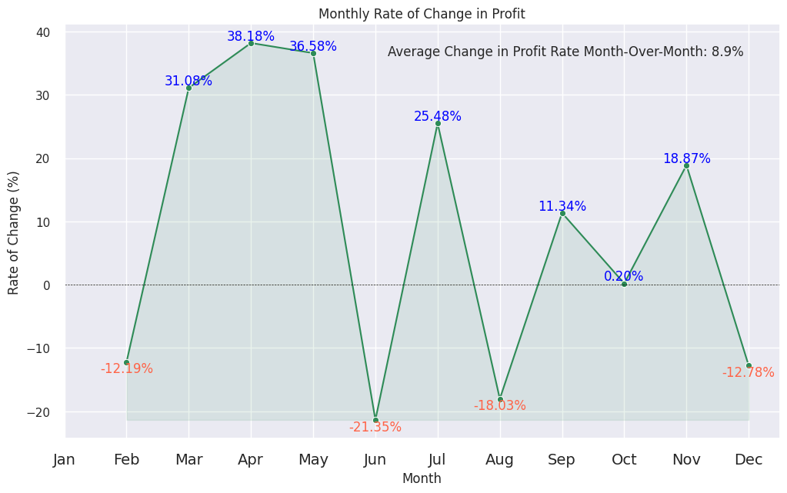

**Insight**:

Strong Growth Periods:
* March: Profit significant increase of 31.08% compared to the previous month.
* April: Profit further accelerated, reaching a peak with a 38.18% increase.
* May: The momentum break with a slightly lower growth rate of 36.58%.
* July: After a dip in June, profit rebounded with a 25.48% increase.
* November: Profit saw a moderate growth of 18.87%.

Decline Periods:
* February: Profit declined by 12.19% compared to the previous month.
* June: A significant drop of 21.35% occurred.
* August: Profit decreased again by 18.03%.
* December: The year ended with a decline of 12.78%.

Average Change in Profit Rate Month-Over-Month: 8.9%

## Cohort Analysis

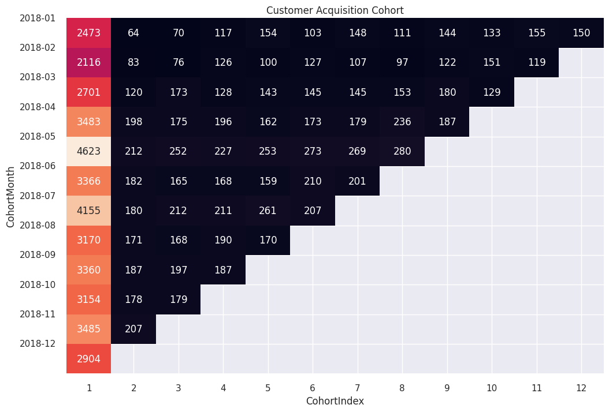

**Insight**:

In the Cohort Table, we had insights that `2.473 customers` made transactions in **January**, but in **February**, only `64 of the same customers` retained and made transactions. However had increased again in May `(154 customers)` and November `(155 customers)`.

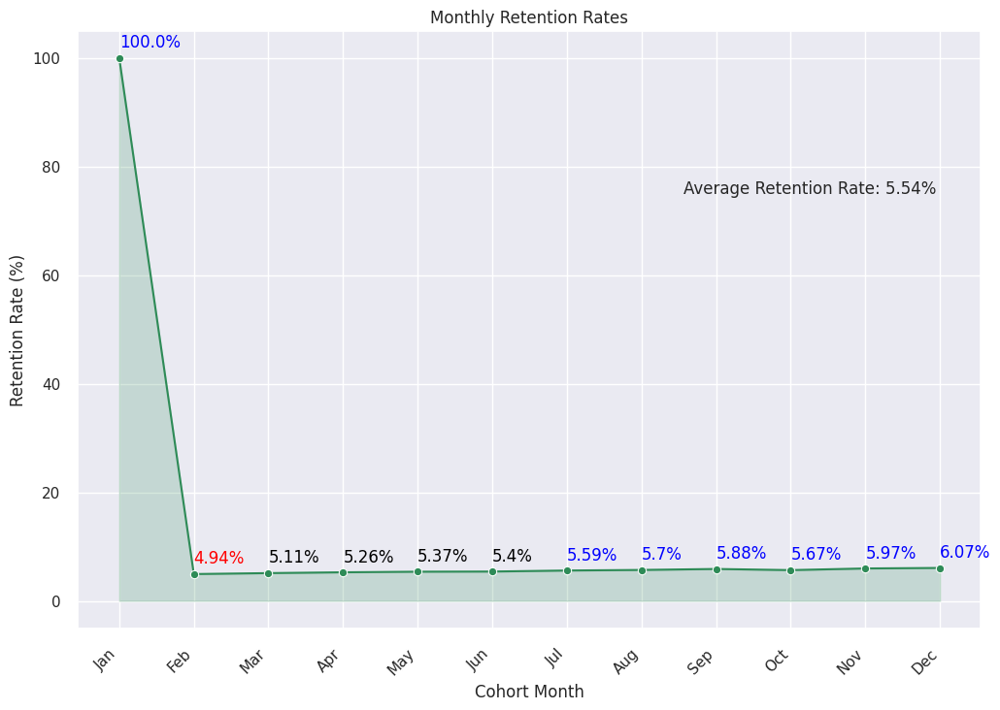

**Insight**:

The **average customer retention rate is `5.54%`**. This means, on average, 5.54% of customers acquired in a specific month are still active in the following months. The rate seems logical to be a low trend because the **average of frequency orders per customer during the year is only 1-2 times**, and the **maximum order is 6 times with only one customer**.

## Pareto Analysis

### Customer VS Sales

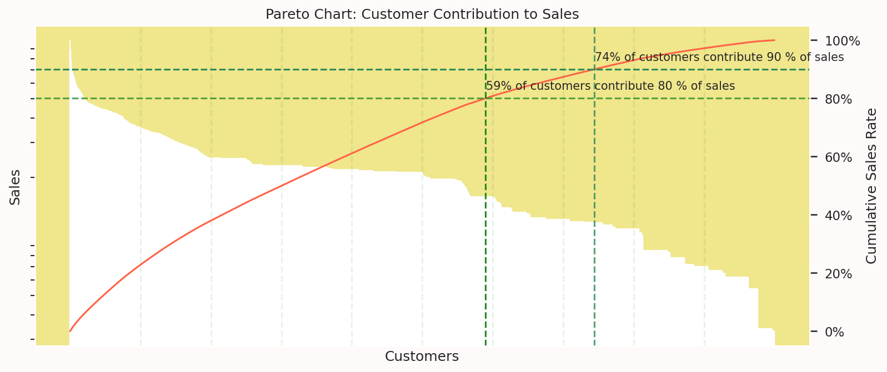

**Insight**:

With a half amount of customers 59 % (22.994), it contributes 80 % of Sales. While the rest of 41 % (15.996) seem to have a low contribution. That's a good start, we'll further analyze the customer segment based on purchase behavior later.

### Product VS Profit

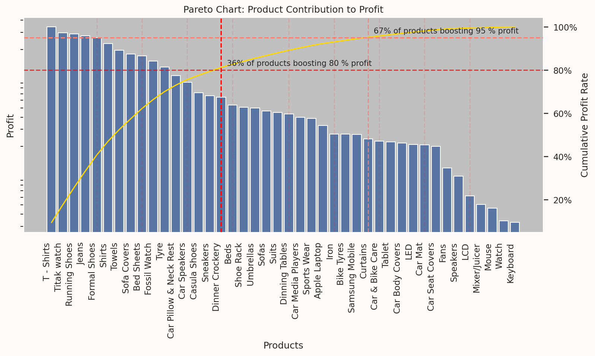

**Insight**:

36 % of products can boost 80 % of profit by year. Then 95 % of profit was boosted by 67 % of products, which means 37 % of products had a poor contribution. Concentrate on the 36 % of top products  because it has a high profit margin and also evaluate the low-performing products when the profit margin is higher than mid-performing, consider not discontinuing them.

## Customer Segmentation

### Build RFM Dataframe

**Define the RFM features as follows:**

* Recency (R): Using Order_Date feature, calculate the number of days since the customer's last purchase.
* Frequency (F): Using Order_Date feature, calculate the number of total order date for each customer. This represents how often the customer has made purchases.
* Monetary (M): Using Sales feature, calculate the total sales for each customer. This represents the total value of the customer's purchases.

| **Customer_Id** | **Recency**    | **Frequency**   | **Monetary**     |
|-----------------|----------------|-----------------|------------------|
| **10000**       | 24             | 2               | 293.00           |
| **10002**       | 132            | 1               | 149.00           |
| **10004**       | 144            | 1               | 85.00            |
| **10006**       | 144            | 2               | 440.00           |
| **10013**       | 227            | 1               | 159.00           |

**Build the K Means clustering model with 3 features according to RFM.**

Why use RFM?
* RFM (Recency, Frequency, Monetary) Analysis is a segmentation technique that uses customer purchase  behavior to group them into segments. And very effective as the purchase behavior can be summarized by using a small number of variables.
* It is also very useful for targeted marketing campaigns and other customer relationship management initiatives.

Why use K-means?
* K-means is an effective clustering algorithm for customer segmentation and RFM analysis due to its simplicity, efficiency, and interpretability.
* A computationally efficient algorithm, suitable for clustering large datasets.
* Can be relied on to determine an appropriate value for 'k' (the number of clusters) using techniques like the elbow method or silhouette analysis.

### Feature Scaling

Ensuring that Recency, Frequency, and Monetary (RFM) features are on a similar scale before applying the K Means algorithm. This will help KMeans create more meaningful and accurate customer segments based on their RFM behavior.

### Find the best K

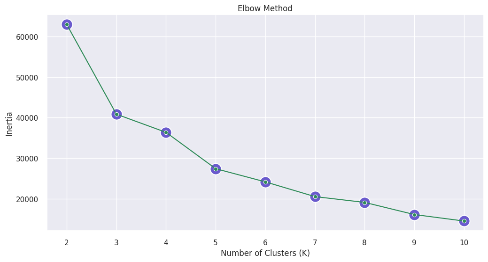
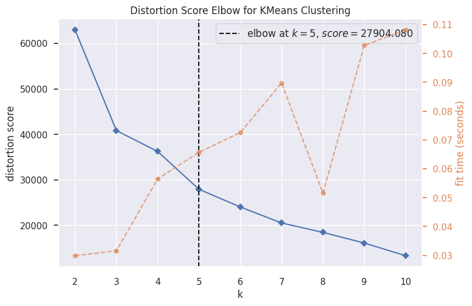
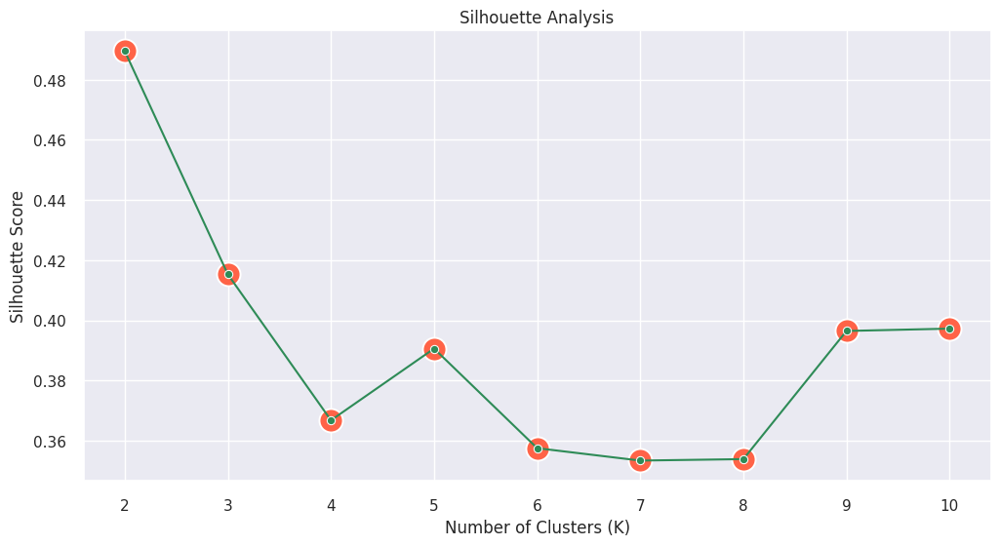

Based on the Elbow Method and Silhouette Analysis suggest 5 clusters for better interpretation and more effective customer segmentation.

### Cluster Viz

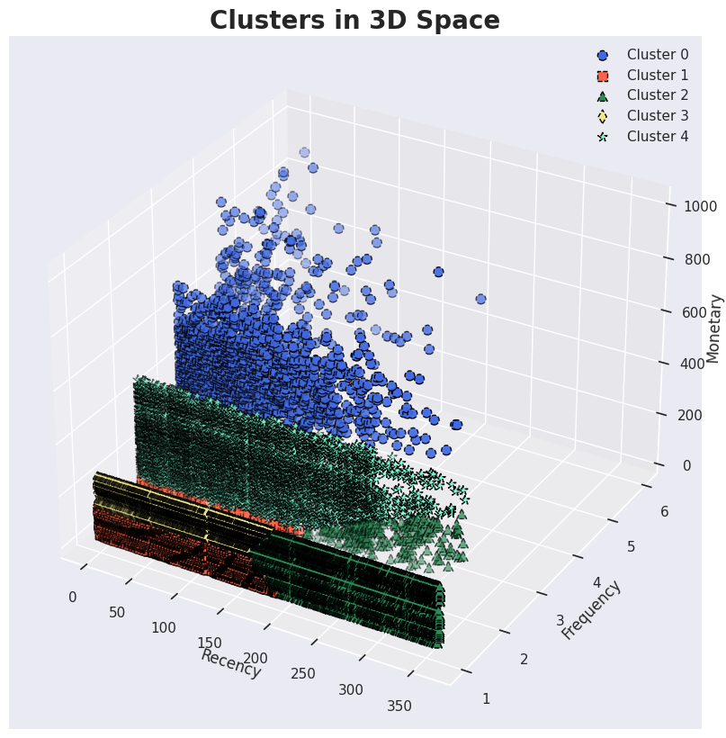

This diagram shows the distribution of customers which is divided into clusters according to the K-Means Clustering algorithm.

### Cluster Analysis

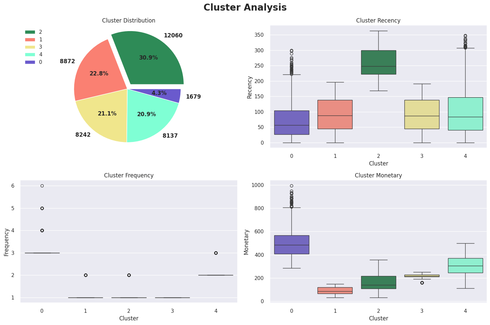

**Clusters breakdown and their potential customer segments based on percentiles to rank the customers from the RFM metrics to identify behavior patterns:**

| Cluster | Customer | High    | Moderate | Low     |
|---------|----------|---------|----------|---------|
| 0       | 1.679    | `R,F,M` | x        | x       |
| 1       | 8.872    | x       | `R,F`    | `M`     |
| 2       | 12.060   | x       | x        | `R,F,M` |
| 3       | 8.242    | x       | `R,F,M`  | x       |
| 4       | 8.137    | `F,M`   | `R`      | x       |

**Here's a breakdown of the clusters and their potential customer segments based on percentiles to rank the customers based on the RFM metrics to identify strong or weak behavior patterns:**

---
**Cluster 0: High recency, high frequency, high monetary**
  * `Distribution (4.31%):` Minority cluster with 1.679 customers.
  * `Recency (around 20%):` However, these customers have purchased very recently.
  * `Frequency (above 90%):` They purchase very frequently.
  * `Monetary (above 90%):` They spend a significant high amount of money.

Yeay, Cluster 0 represents the best customers, our `Champions Customers`, they are the company's most valuable assets. They purchase frequently, spend a lot of money, and have made purchases very recently.

---

**Cluster 1: Moderate recency, moderate frequency, low monetary**
  * `Distribution (22.75%):` 8.872 customers.
  * `Recency (around 30%):` Customers who had made purchases somewhat recently too.
  * `Frequency (50%)`: Their purchase frequency is moderate.
  * `Monetary (around 20%)`: They spend a small amount of money.

It represents the `Need Attention Customers`.	These customers have purchased recently but have only made one purchase. They need encouragement for repeat purchases and more spending.

---

**Cluster 2: Low recency, low frequency, low monetary**
  * `Distribution (30.93%):` Dominant clusters with 12.060 customers.
  * `Recency (above 80%):` Customers who hadn't made a purchase in a long time.
  * `Frequency (50%):` Their purchase frequency is only 1 transaction.
  * `Monetary (30%):` They only spend a small amount of money when they make a purchase.

Very clearly, it represents the `At-Risk/Lost Customers`. They haven't purchased recently and might be churned. It's the biggest problem for business.

---

**Cluster 3: Moderate recency, moderate frequency, moderate monetary**
  * `Distribution (21.14%):` 8.242 customers.
  * `Recency (around 30%):` Customers who had made purchases relatively recently.
  * `Frequency (around 50%):` They purchase frequently.
  * `Monetary (around 50%):` They spend a slightly good amount of money.

It represents the `Promising Customers`. They have a moderate purchasing history but haven't purchased recently. Treat them well then I promise they will be loyal.

---

**Cluster 4: Moderate recency, high frequency, high monetary**
  * `Distribution (20.87%):` 8.137 customers.
  * `Recency (around 30%):` Customers who had made purchases relatively recently.
  * `Frequency (above 80%):` They purchase very frequently.
  * `Monetary (around 80%):` They spend a significant amount of money.

  This cluster aligns with the `Loyal Customers`, as they have a high purchase frequency and high spending, even though their recent activity is moderate.

  ---

## Conclusion

**To summarize, Kestrel E-commerce has identified key areas for improvement, including customer retention, product performance, and targeted marketing strategies.**

* Kestrel E-commerce's sales performance and profit gained have been quite volatile and has a positive trend throughout the year.

* However, they have a problem with a low rate of customer retention. The average of frequency orders per customer during the year is only 1-2 times. It’ll be validated by the dominance of At-Risk/Lost Customers in segmentation.

* 59% of customers contribute 80% of sales where they have high to moderate spending purchases throughout the year and it could be the High-Value customers. And only 36% of products perform well, boosting 80% of profit by year, meanwhile, low-performing products like Mouse, Watch, and Keyboard need evaluation to sell better.

* There are 5 Clusters of Customers based on RFM/Spending Profile
  1. At-Risk/Lost Customers 30.93%
  2. Need Attention Customers 22.75%
  3. Promising Customers 21.14%
  4. Loyal Customers 20.87%
  5. Champions Customers 4.31%

## Recommendation

`Key Takeaways to Boost Sales:`

* **Peak Seasons:** Launch major campaigns, offer discounts, and run festive promotions.
* **Off-Peak Seasons:** Stimulate demand with targeted promotions and clearance sales.
* **Day-of-Week and Time-of-Day:** Optimize marketing efforts and offers for peak times.
* **Seasonal Stock Planning:** Adjust inventory levels to meet demand fluctuations.
* **Demand Forecasting:** Utilize historical data to accurately forecast future demand.

`Improve Customer Retention Strategies:`

* **Personalized Marketing:** Target specific customer segments with tailored campaigns.
* **Enhanced Customer Experience:** Improve website usability, customer service, and brand interactions.
* **Loyalty Programs:** Reward repeat purchases with points, discounts, or exclusive offers.
* **Product and Service Innovation:** Continuously introduce new offerings and incorporate customer feedback.

`Optimize Resource Allocation and Improve Profitability:`

Identify High-Value Customers: Focus on the top 59% of customers who drive 80% of sales.
Personalized Marketing: Tailor marketing efforts to the needs and preferences of high-value customers.
Prioritize Top-Performing Products: Concentrate on the 36% of products that generate 80% of profit.
Product Line Review: Evaluate the performance of low-performing products and consider discontinuing or rebranding them.

`Based on the analysis, the marketing team can develop targeted marketing strategies for each customer segment:`

* `At-Risk/Lost Customers`:
  * Win-Back Campaigns: Offer limited-time discounts or special promotions.
  * Personalized Communication: Reach out with a sincere apology and offer to resolve any issues.
  * Re-Engagement: Send targeted emails or WhatsApp highlighting new products or promotions.
  * Social Media Engagement: Interact with them on social media to rekindle interest.
* `Need Attention`:
  * Also personalized campaigns: email or WhatsApp highlighting new products or special offers.
  * Social Media Engagement: Address campaigns to spark interest.
  * Offer tiered rewards based on purchase frequency.
  * Implement a subscription model for repeat purchases.
* `Promising`:
  * Targeted Marketing: Use email marketing and WhatsApp to promote relevant products.
  * Cross-Selling and Upselling: Suggest complementary products or higher-tier options.
  * Personalized Offers: Offer discounts or special deals to incentivize repeat purchases.
  * Customer Surveys: Gather feedback to understand their needs and preferences.
* `Loyal Customers`:
  * Personalized Marketing: Utilize data to tailor promotions and offers.
  * Loyalty Programs: Implement tiered loyalty programs with exclusive rewards.
  * Customer Advocacy: Encourage customer reviews and referrals.
  * Early Access: Provide early access to new products or sales.
* `Champions`:
  * VIP Treatment: Provide exceptional customer service and exclusive benefits.
  * Co-Creation: Involve them in product development or marketing campaigns.
  * Personalized Experiences: Tailor experiences to their individual preferences.
  * Exclusive Events: Invite them to special events or product launches.
